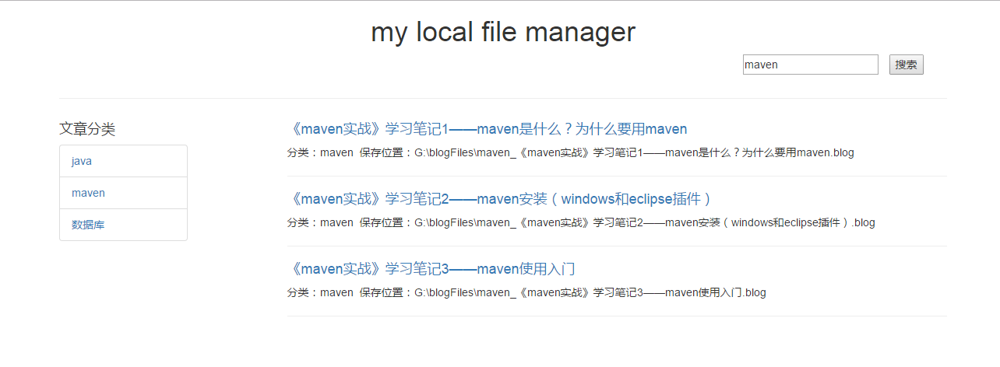

## 项目描述
这是一个很简单的类博客系统，旨在方便管理本地笔记文档，整体采用spring+springmvc+angularjs+bootstrap+markdown实现，主要包括分类、查看、搜索等功能。

## 项目背景
由于记忆有限，学的东西难免忘记，因此就需要一定的笔记来帮助记忆。 
之前基本都是在CSDN用博客，或者有道云笔记，或者直接本地文件系统的文档来充当笔记。 
这些方式都有他们的优势所在，但是在实际使用时，他们又都有不是那么顺手的地方，比如：csdn和有道云笔记都必须联网才能使用，这使得在没有网络的情况下就显得鸡肋；而本地文件系统虽然可以不联网，但在查看、分类的直观性上却又不如博客网站和有道云笔记。 
因此，我就希望有那么一个系统，可以既能像博客网站那样直观的分门别类和搜索，又能使我在不联网的情况下也能方便的查看。 
在这种需求前提下，便找到了hexo博客系统，可以很方便的管理本地博客，于是我用了一段时间。 
然而，当博客多了以后我又发现，里边的搜索功能有些鸡肋，需要连接谷歌才能搜索，这就使得搜索成了摆设，于是我便想到自己弄一个简单的本地文件管理系统，类似hexo，却又不完全相同。 
目的就是方便的查看本地笔记文件，大概界面如下：

## 环境说明
maven
tomcat7
jdk8
spring4.3.9
angularjs1.6.9
jquery3.2.1
bootstrap3.3.7
markdown

## 已实现功能
1. 基本框架和前台简单界面
2. 实现根据后台类型集合动态显示分类
3. 实现点击具体分类查询出该类下笔记